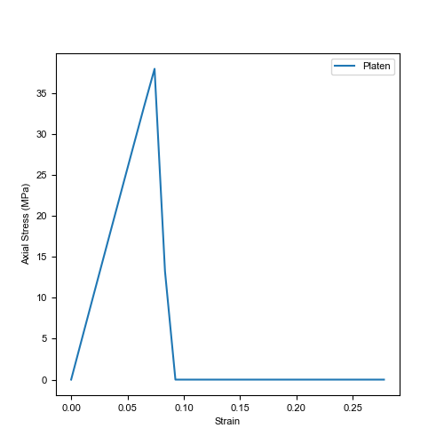

# Introduction

This Python package performs transformations on hybrid finite-discrete element method (FDEM) models with an unstructured grid in vtk/vtu/vtp format. It currently supports arrays of simulation files from the FDEM solvers:
- [Irazu](https://www.geomechanica.com/software/),
- [Y-Geo](https://geogroup.utoronto.ca/software/) (and its common derivatives), as well as 
- [OpenFDEM](https://openfdem.com/html/index.html).

The package is heavily dependent on `pyvista` and is limited to `Python >=3.5, <=3.9`. The package is maintained by the [Grasselli's Geomechanics Group](https://geogroup.utoronto.ca/) at the University of Toronto, Canada, and is part of a collaborative effort by the open-source pacakge [OpenFDEM](https://openfdem.com/html/index.html).

## Functionality

The functionality of this script was developed with the objective of extracting common information needed when running simulations. Highlights of the script are:

- Extract information within the FDEM Model based on the name of the array (e.g., Stress, Strain, Temperature, etc...) Works in 2D and 3D.

- Extract stress-strain information for UCS and BD Simulations (Works in 2D and 3D). Optional addition of virtual strain gauges (Limited to 2D).

- Plotting stress vs strain curve.



- Calculate the Elastic Modulus of the dataset. Eavg, Esec and Etan can be evaluated. Works in 2D and 3D.

```console
# Variants of E tangent
Etan at 50%: 51683.94MPa
Etan at 50% with linear best fit disabled: 51639.22MPa
Etan at 50% using strain gauge data: 50275.03MPa
# Variants of E secant
Esec at 70%: 51681.01MPa
Esec at 50%: 51817.43MPa
# Variants of E average
Eavg between 50-60%: 51594.49MPa
Eavg between 20-70% with linear best fit disabled: 51660.62MPa
```

- Extract information of a particular cell based on a sequence of array names. This can be extended to extracting information along a line. Works in 2D and 3D.


- Extract information of a threshold dataset criteria based on a sequence of array names. Works in 2D and 3D.


- Extract mesh information and plot rosette/polar plots. Limited to 2D.


- Automatic detection/ User-defined assigment of loading direction when analysing mechanical simulations, namely UCS, BD, and PLT, in both 2D and 3D simulations.

```console
Script Identifying Platen
	Platen Material ID found as [1]
	3D Loading direction detected as [1] is Y-direction
Values used in calculations are
	Area	3721.00
	Length	122.00
Progress: |//////////////////////////////////////////////////| 100.0% Complete
```

## Additional Support 

Please refer to the user manual for detailed information pertaining to the various functions and their usage/arguments. For specific script requests and bug, please report them on our [github page](https://github.com/OpenFDEM). 

