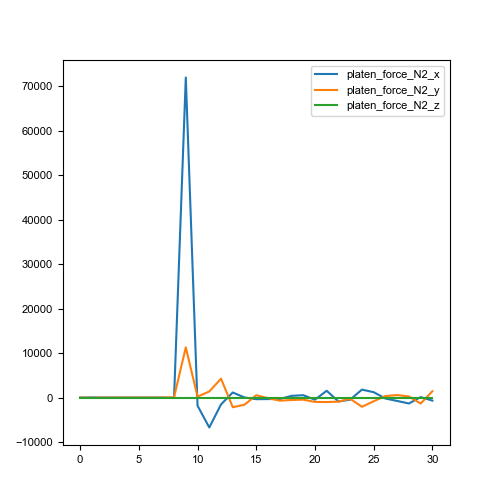
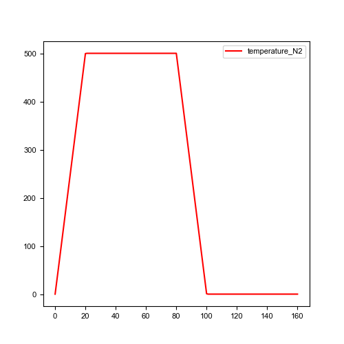
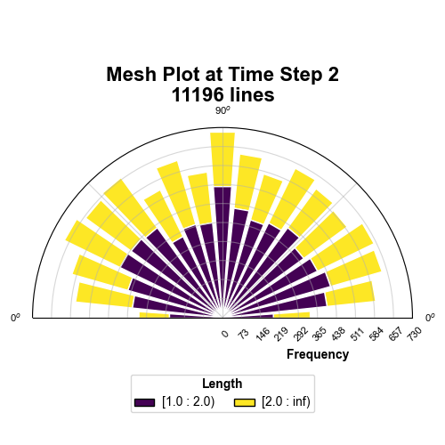

# pyfdempp - An FDEM Visualiser Post-Processing Package


## About

This Python package performs transformations on hybrid finite-discrete element method (FDEM) models with an unstructured grid in vtk/vtu/vtp format. It currently supports arrays of simulation files from the FDEM solvers:
- [Geomechanica's Irazu software](https://www.geomechanica.com/software/),
- [Y-Geo](https://geogroup.utoronto.ca/software/) (and its common derivatives), as well as 
- [OpenFDEM](https://openfdem.com/html/index.html).

The package is heavily dependent on `pyvista` and is limited to `Python >=3.5`. The package is maintained by the [Grasselli's Geomechanics Group](https://geogroup.utoronto.ca/) at the University of Toronto, Canada, and is part of a collaborative effort by the open-source pacakge [OpenFDEM](https://openfdem.com/html/index.html).

## Functionality

The functionality of this script was developed with the objective of extracting common information needed when running simulations. Highlights of the script are:

- Get model information.
```python
import pyfdempp as fd
model = fd.Model("abs_model_path_on_machine")
# Getting number of points in your model.
model.n_points
```
Output:
```console
11904
```

- Extract information within the FDEM Model based on the name of the array (e.g., Stress, Strain, Temperature, etc...) Works in 2D and 3D.

- Extract stress-strain information for UCS and BD Simulations (Works in 2D and 3D). Optional addition of virtual strain gauges (Limited to 2D).
```python3
import pyfdempp as fd
model = fd.Model("abs_model_path_on_machine")
model.complete_stress_strain(progress_bar=True)
```
Output:
```console
Script Identifying Platen
   Platen Material ID found as [1]
   Progress: |//////////////////////////////////////////////////| 100.0% Complete
   1.51 seconds
     Platen Stress  Platen Strain
 0    0.000000e+00       0.000000
 1    4.825237e+00       0.009259
 2    9.628823e+00       0.018519
 3    1.441437e+01       0.027778
 4    1.919164e+01       0.037037
 ..            ...            ...
 57   2.036137e-30       0.240741
 58   2.036137e-30       0.250000
 59   2.036137e-30       0.259259
 60   2.036137e-30       0.268519
 61   2.036137e-30       0.277778
 
 [62 rows x 2 columns]
```
- Plotting stress vs strain curve.
  
- 


- Calculate the Elastic Modulus of the dataset. Eavg, Esec and Etan can be evaluated. Works in 2D and 3D.
```python
import pyfdempp as fd
model = fd.Model("abs_model_path_on_machine")
df_1 = model.complete_UCS_stress_strain(st_status=True)

# Variants of E tangent
print('Etan at 50%%: %.2fMPa' % model.Etan50_mod(df_1)[0])
print('Etan at 50%% with linear best fit disabled: %.2fMPa' % model.Etan50_mod(df_1, linear_bestfit=False)[0])
print('Etan at 50%% using strain gauge data: %.2fMPa' % model.Etan50_mod(df_1, loc_strain='Gauge Displacement Y', plusminus_range=1)[0])
# Variants of E secant
print('Esec at 70%%: %.2fMPa' % model.Esec_mod(df_1, 70))
print('Esec at 50%%: %.2fMPa' % model.Esec_mod(df_1, 0.5))
# Variants of E average
print('Eavg between 50-60%%: %.2fMPa' % model.Eavg_mod(df_1, 0.5, 0.6)[0])
print('Eavg between 20-70%% with linear best fit disabled: %.2fMPa' % model.Eavg_mod(df_1, 0.2, 0.7, linear_bestfit=False)[0])
```
Output:
```console
   Etan at 50%: 51683.94MPa
   Etan at 50% with linear best fit disabled: 51639.22MPa
   Etan at 50% using strain gauge data: 50275.03MPa
   
   Esec at 70%: 51681.01MPa
   Esec at 50%: 51817.43MPa
   
   Eavg between 50-60%: 51594.49MPa
   Eavg between 20-70% with linear best fit disabled: 51660.62MPa
```

- Extract information of a particular cell based on a sequence of array names. This can be extended to extracting information along a line. Works in 2D and 3D.


- Extract information of a threshold dataset criteria based on a sequence of array names. Works in 2D and 3D.


- Extract mesh information and plot rosette/polar plots. Limited to 2D.


- Automatic detection/ User-defined assigment of loading direction when analysing mechanical simulations, namely UCS, BD, and PLT, in both 2D and 3D simulations.
```console
Script Identifying Platen
	Platen Material ID found as [1]
	3D Loading direction detected as [1] is Y-direction
Values used in calculations are
	Area	3721.00
	Length	122.00
Progress: |//////////////////////////////////////////////////| 100.0% Complete
```

## Additional Support 

Please refer to the user manual for detailed information pertaining to the various functions and their usage/arguments. For specific script requests and bug, please report them on our [github page](https://github.com/OpenFDEM). 


